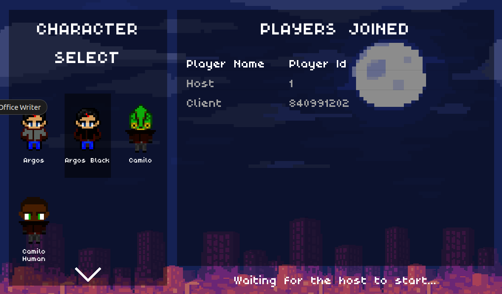

# Game Projects
## Itch.io: [Itch.io games here.](https://islandtreehouse.itch.io)
## Peace Pong
Hosted on Itch.io. A casual browser-game.

## Morpheus
A top-down 2D game I was working on using Godot with a few other people. 

The repository is privately hosted somewhere else but I contributed most of the source code.

Images of the game is shown in this repo:

I designed the menu from the background art that was
given to me and coded a multiplayer lobby which was working in a LAN. We also had some gameplay
mechanics working.
